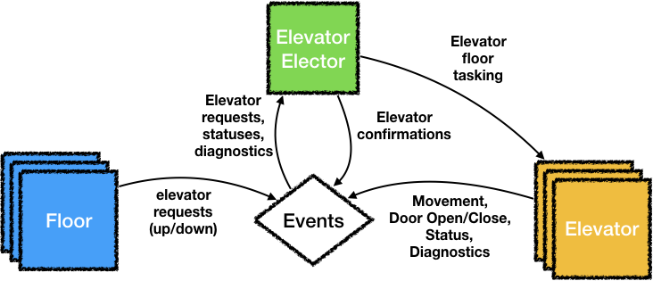

# Elevator Demo

This is a runnable demo, demonstrating an elevator system.  

* Floors can request an elevator, by publishing a `ElevatorRequestUpEvent` or `ElevatorRequestDownEvent`.
* Elevators announce themselves and provide status updates and operation events.
* The [`ElevatorElector`](src/main/java/com/github/jgriff/kuali/elevatordemo/ElevatorElector.java) consumes the elevator request events and elects the most appropriate elevator
to answer the call.  It publishes a `ElevatorConfirmEvent` and then tasks the appropriate elevator directly.
The elector reacts and considers the availability of elevators based on the events they are publishing, so it
does not need to query every elevator every time a new request arrives.   



This is a [reactive](https://www.reactivemanifesto.org/) project, and heavily uses 
[Project Reactor](https://projectreactor.io/) and the [Spring Framework](https://spring.io/).
In particular, the [entire elevator movement simulation](src/main/java/com/github/jgriff/kuali/elevatordemo/BasicElevator.java#L88)
is a paralleled flux, giving us sophisticated control over the threading, delays (to simulate time), and stream of events
we are publishing.  

## Build
This project builds with [Gradle](https://gradle.org/), but all you need
is **JDK 1.8** or better (the [wrapper](https://docs.gradle.org/current/userguide/gradle_wrapper.html) will provision itself).

```
$ ./gradlew build
```

Or, if you are on Windows:
``` 
C:\> gradlew.bat build
```


## Run
This is a [Spring Boot](https://projects.spring.io/spring-boot/) app, so you can simply run the executable jar in place.
It will be built into the `/build/libs` directory by Gradle.

``` 
$ java -jar build/libs/elevator-demo-0.0.1.BUILD-SNAPSHOT.jar
```
The demo is orchestrated by [`ElevatorDemo`](src/main/java/com/github/jgriff/kuali/elevatordemo/ElevatorDemo.java).
It simply requests a random floor every 10 seconds.  

## Tests
TDD love.  If you want to run *just* the tests,

``` 
$ ./gradlew test
```  
Or from within your IDE.  This will compile all of the test sources (`src/test/java`) and then run them 
on the [JUnit5 Platform](https://junit.org/junit5/docs/current/user-guide/).

You can view the test report by opening `build/reports/tests/test/index.html`.
